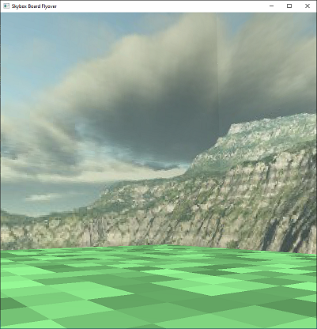
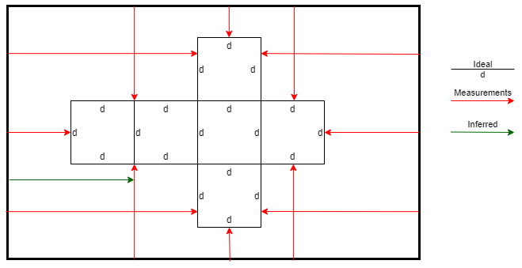

# Bevy Skybox

Provides a skybox from a given image that can be attached to a [bevy](https://docs.rs/bevy) camera.

Assumes that the image is of the same format as the examples given in the `assets` folder:
a net of six squares in the same shape as these examples, exactly aligned with the image
rectangle and filling most of its width and height.

## Usage

The usage is documented in the module comment at the top of `src/lib.rs`.

To demonstrate this, `examples\board_flyover.rs` puts a skybox around a flat "board". Key/mouse camera movement is provided by `bevy_fly_camera`.



Skybox images come from the following sources.

* **sky1.png** - https://www.cleanpng.com/png-skybox-cube-mapping-texture-mapping-terragen-textu-1384141
* **sky2.png** - https://www.cleanpng.com/png-skybox-texture-mapping-cube-mapping-sky-cloud-920475 (flipped)

## Image processing

Many skybox are available as net images. `bevy_skybox` assumes that the image is a specific net
of a cube.

The assumptions about the image are listed in `src/image.rs`, but the image is measured like this.



## Build

Build using `stable` or `nightly` toolchain, e.g.

```
cargo run --release --example board_flyover
```

